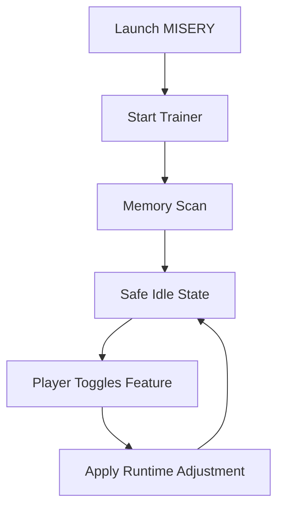

# MISERY Trainer — When Survival Becomes a Discipline

In **MISERY**, the world does not care about comfort. Hunger gnaws, radiation whispers, and every bullet is a decision weighted with consequence. The **MISERY Trainer** was created not to soften this cruelty, but to help you *understand it*.
Think of it as a quiet notebook carried through the Zone — a way to observe, test, and refine your survival instincts without breaking immersion.

---

## 🌫 Overview

MISERY Trainer is a **Windows-based enhancement tool** designed specifically for the MISERY overhaul. It provides modular control over survival mechanics, combat pressure, and environmental awareness — all while respecting the brutal philosophy of the mod.

It is used by:

* Newcomers learning MISERY’s unforgiving systems
* Veterans testing builds and difficulty curves
* Explorers who want insight without removing danger

Nothing is forced. Everything is optional.

---

## 👁 Environmental Awareness & ESP

The Zone lies by omission. The trainer helps you read between its silences.

* NPC and mutant highlights with distance fade
* Stash and loot container visibility
* Artifact detection radius overlay
* Trap and anomaly indicators
* Adjustable colors for fog, night, and storms

These tools don’t shout — they murmur, preserving tension.

---

## 🔫 Combat & Weapon Control

Gunfights in MISERY are brief, decisive, and terrifying. The trainer offers *measured refinement*:

* Recoil stabilization (configurable per weapon)
* Spread and sway tuning for realism testing
* Ammo consumption control
* Optional damage scaling for sandbox runs
* Ballistics visualization for long-range engagements

Not invincibility — *consistency*.

---

## 🧭 Survival & Resource Modules

Where MISERY truly bites.

* Hunger, thirst, fatigue freeze or scaling
* Radiation and psy damage adjustment
* Weight and stamina control
* Condition decay tuning for weapons and armor
* Time flow modifier for slow observation

> [!NOTE]
> Many players use these tools temporarily — to learn systems — then disable them entirely.

---

## ⚙️ Setup & Launch Ritual

As simple as lighting a cigarette before dawn.

### Requirements

* Windows 10 / 11
* S.T.A.L.K.E.R. with MISERY installed
* Administrator access

### Startup Steps

```text
1. Launch MISERY and load into the game world
2. Run MISE​RYTrainer.exe as Administrator
3. Press INSERT to open the trainer panel
4. Enable or disable modules in real time
```

---

## 🔄 How the Trainer Thinks



The trainer sleeps when unused. The Zone remains untouched unless you decide otherwise.

---

## ❓ FAQ — Questions Asked by the Campfire

**Is this meant for online play?**
No. MISERY Trainer is designed strictly for **single-player environments**.

**Can I save presets?**
Yes. Multiple profiles can be saved and swapped between sessions.

**Does it reduce immersion?**
Only if you let it. Many players enable features briefly, then return to vanilla MISERY.

**Will updates break it?**
Version checks warn you when mismatches occur.

**Can I run ESP only?**
Absolutely. Each module stands alone.

> [!WARNING]
> Using trainers may conflict with the intended experience of hardcore mods. Use thoughtfully and responsibly.

---

## 🌒 Why Players Use MISERY Trainer

To learn without restarting for the tenth time.
To test equipment without endless grind.
To understand how close they truly are to death.

It’s not mercy.
It’s *knowledge*.

---

## 🌑 Final Thoughts

The Zone does not forgive mistakes.
But it does reward understanding.

The **MISERY Trainer** is not a shield — it is a lantern.
You decide when to light it.

Walk carefully, stalker.
The Zone is always listening.
